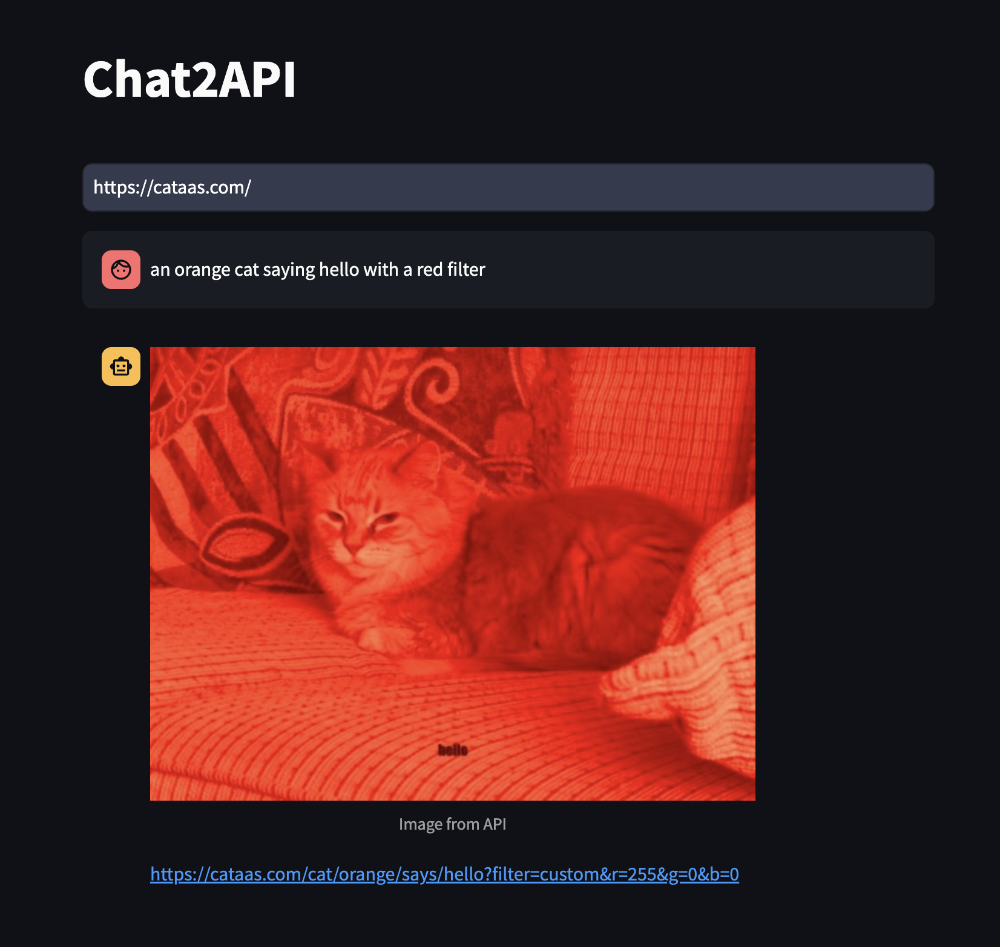

# Chat2API

The goal of this project is to generate URLs for retrieving information from an API, based on the corresponding API documentation URL.



## Configuration

### 1. Install requirements:

```bash
pip install -r requirements.tx
```

### 2. Create .streamlit/secrets.toml file:

```toml
gemini_secret_key = "your_api_key"
```

## Run

```bash
streamlit run app.py
```
